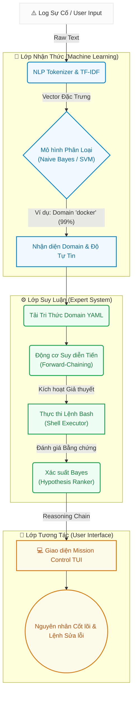

# 🐧 Linux Doctor — Hệ Thống Trí Tuệ Nhân Tạo Lai (Hybrid AI) Xử Lý Sự Cố


-orange)


> **Nhập bất kỳ sự cố Linux nào bằng ngôn ngữ tự nhiên — Linux Doctor sẽ tự động dự đoán miền sự cố (Domain), chẩn đoán nguyên nhân gốc rễ, giải thích logic suy luận và đề xuất các lệnh khắc phục an toàn thông qua giao diện điều khiển (Mission Control TUI).**

---

## 🌟 1. TỔNG QUAN DỰ ÁN (EXECUTIVE SUMMARY)

**Linux Doctor** là một hệ thống tự động hóa vận hành IT đột phá dành cho các kỹ sư SRE và Sysadmin. Dự án được thiết kế với kiến trúc **Hybrid AI (AI Lai)**, kết hợp giữa tốc độ nhận thức của Machine Learning và độ chính xác tuyệt đối của Hệ thống Chuyên gia (Expert System). 

Toàn bộ hệ thống được xây dựng hoàn toàn độc lập (from scratch), không phụ thuộc vào các framework nặng nề như PyTorch hay Scikit-Learn, giúp hệ thống cực kỳ nhẹ, bảo mật và dễ dàng audit.

---

## ⚙️ 2. KIẾN TRÚC HỆ THỐNG (SYSTEM ARCHITECTURE)

Hệ thống mô phỏng chính xác cách một kỹ sư Linux kỳ cựu tiếp cận và giải quyết vấn đề:

1. **Lớp Nhận Thức (Machine Learning):** Đọc log và ngay lập tức khoanh vùng vấn đề thuộc nhóm nào (Ví dụ: Docker, CPU, Network).
2. **Lớp Suy Luận (Expert System):** Khi đã biết nhóm lỗi, hệ thống tự động chạy các lệnh bash an toàn (như `groups`, `systemctl status`) để thu thập chứng cứ, sau đó dùng thuật toán Bayes để chấm điểm và tìm ra nguyên nhân gốc rễ.



---

## 🧠 3. HIỆU NĂNG MÔ HÌNH HỌC MÁY (ML PIPELINE)

Hệ thống Machine Learning đã được nâng cấp quy mô (Scale-up) với tập dữ liệu **101.758 mẫu** được phân bổ đồng đều qua 12 domain sự cố Linux (Docker, CPU, Disk, Memory, Network, DNS, v.v.). Toàn bộ các thuật toán (TF-IDF, Naive Bayes, Logistic Regression, Linear SVM) đều được viết thủ công bằng **NumPy**.

### Thành Tích Vượt Trội của Multinomial Naive Bayes
*   **F1-Score: 99.49%**
*   **Chi tiết:** Mô hình Naive Bayes thể hiện sức mạnh tuyệt đối khi phân tích dữ liệu dạng Text. Nó xử lý xuất sắc các từ vựng gây nhiễu, cho ra kết quả phân loại gần như hoàn hảo. Dưới đây là ma trận nhầm lẫn (Confusion Matrix) chứng minh tỷ lệ dự đoán sai (False Positives) ở mức cực tiểu.


*(Hệ thống cũng đi kèm các mô hình Logistic Regression (99.2%) và Linear SVM (99.4%) để dự phòng và tính toán xác suất tự tin).*

---

## 🔬 4. GIAO DIỆN CHUYÊN GIA (MISSION CONTROL TUI)

Hệ thống giao diện dòng lệnh không đơn thuần là in ra kết quả, mà là một bảng điều khiển tương tác. Nó hiển thị **Reasoning Chain (Chuỗi suy luận)** minh bạch để kỹ sư có thể tin tưởng vào AI.

Dưới đây là một số hình ảnh thực nghiệm hệ thống tự chẩn đoán sự cố:

### Khắc phục sự cố Docker (Phân quyền & Daemon)
Hệ thống nhận diện người dùng thiếu quyền (Permission) và đề xuất lệnh `usermod` để thêm người dùng vào nhóm docker.


### Khắc phục sự cố Quá Tải Hệ Thống (CPU/Memory)
Khi hệ thống bị treo do CPU Throttling hoặc Load Average cao, AI sẽ chạy các lệnh kiểm tra mức tiêu thụ tài nguyên và khoanh vùng tiến trình gây nghẽn.


### Khắc phục sự cố Định Tuyến & Máy Chủ (Network & Nginx)
AI kiểm tra bảng định tuyến, tường lửa (Firewall) và các file cấu hình Nginx để tìm ra lỗi sai cú pháp hoặc xung đột cổng (Bind Port).


> 👉 **ĐỂ XEM BÁO CÁO THỰC NGHIỆM CHI TIẾT NHẤT:** Vui lòng truy cập Sách trắng trực quan tại [**report_docs/BAO_CAO_CHI_TIET.md**](report_docs/BAO_CAO_CHI_TIET.md). Tài liệu này chứa toàn bộ 23 hình ảnh chứng minh năng lực của AI trên 11 Domain sự cố cốt lõi.

---

## 🚀 5. HƯỚNG DẪN CÀI ĐẶT NHANH (QUICK START)

Bạn có thể trải nghiệm toàn bộ sức mạnh của Linux Doctor (bao gồm các Model đã huấn luyện sẵn) thông qua vài lệnh đơn giản.

**Cách 1: Cài đặt tự động (Linux/macOS)**
```bash
curl -fsSL https://raw.githubusercontent.com/NTbankey1/LinuxDoctor/main/scripts/install.sh | bash
```

**Cách 2: Cài đặt thủ công**
```bash
git clone https://github.com/NTbankey1/LinuxDoctor.git
cd LinuxDoctor
make setup
linux-doctor "disk is full on /var"
```

---

## 🛠️ 6. NỢ KỸ THUẬT & LỘ TRÌNH PHÁT TRIỂN (ENGINEERING ROADMAP)

Thông qua quá trình kiểm toán kiến trúc, hệ thống đang tập trung vào 4 cột mốc chính để đạt chuẩn Doanh nghiệp (Enterprise-Ready):

1.  🛡️ **Bảo Mật (P0):** Nâng cấp module `ShellExecutor` từ Denylist (chặn lệnh xấu) sang **Allowlist** (chỉ cho phép các lệnh đã phê duyệt) nhằm triệt tiêu hoàn toàn rủi ro Command Injection.
2.  ⚡ **Hiệu Năng (P1):** Đưa cơ chế thu thập bằng chứng từ chạy tuần tự sang chạy song song (**Parallel Execution**), rút ngắn thời gian chẩn đoán từ 15 giây xuống dưới 2 giây.
3.  🗄️ **Lưu Trữ (P2):** Thay thế việc lưu trạng thái trên RAM bằng cơ sở dữ liệu (SQLite/PostgreSQL) để duy trì lịch sử sự cố (Incident History).
4.  🧠 **Suy Luận (P3):** Áp dụng kiến trúc Backward Chaining để xác minh chéo nguyên nhân.

---

**Bản Quyền:** MIT License. Sử dụng tự do cho mục đích cá nhân, học thuật và thương mại.  
*Phát triển dành riêng cho cộng đồng kỹ sư Linux và những người đam mê AI.*
