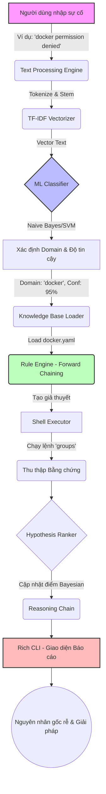

# 📊 BÁO CÁO HỆ THỐNG TRỰC QUAN: LINUX DOCTOR HYBRID AI

Báo cáo này cung cấp cái nhìn sâu sắc, trực quan về hệ thống **Linux Doctor**, từ luồng hoạt động tổng thể (Architecture Flow), hiệu suất của các mô hình Machine Learning (được viết từ đầu), cho đến các bằng chứng thực nghiệm (Test Evidences) của Hệ thống Chuyên gia (Expert System).

---

## 1. ⚙️ Luồng Hệ Thống Tổng Thể (System Architecture Flow)

Luồng hoạt động của hệ thống được chia thành 2 giai đoạn chính: **Machine Learning** (dự đoán domain) và **Expert System** (tìm kiếm nguyên nhân gốc rễ và đưa ra giải pháp).

---

## 2. 🧠 Đánh Giá Hiệu Suất Mô Hình Machine Learning

Các mô hình được huấn luyện bằng tập dữ liệu **100.000+ samples**, sử dụng code xây dựng hoàn toàn từ **NumPy** (không dùng framework như Scikit-learn). Dưới đây là phân tích Confusion Matrix và biểu đồ trực quan của từng thuật toán.

### 2.1. Multinomial Naive Bayes (Mô Hình Tốt Nhất 🏆)
> **Độ chính xác (F1-Score):** 99.49%  
> **Ưu điểm:** Khả năng mở rộng tuyệt vời với dữ liệu văn bản (Text Data), ổn định và cực kỳ nhanh.

### 2.2. Linear SVM
> **Độ chính xác (F1-Score):** ~99.4%  
> **Ưu điểm:** Tách biệt các mặt phẳng siêu hình tốt (Margin optimization), sức mạnh vượt trội khi đối mặt với các domain có ranh giới từ vựng chồng chéo.

### 2.3. Logistic Regression
> **Độ chính xác (F1-Score):** ~99.2%  
> **Ưu điểm:** Cho ra điểm xác suất (Probability) rất mượt mà thông qua hàm Softmax, hỗ trợ đắc lực cho việc Calibration (hiệu chuẩn độ tin cậy của AI).

---

## 3. 🔬 Minh Chứng Thực Nghiệm (Mission Control TUI)

Hệ thống chuyên gia đã được thử nghiệm thực tế qua nhiều sự cố Linux khác nhau. Dưới đây là giao diện Mission Control tương tác, giải trình chi tiết nguyên nhân sự cố thông qua hệ thống log và reasoning chain.

### 🐳 Domain: Docker
Hệ thống có khả năng phân tách lỗi quyền hạn (Permission), lỗi Daemon, hay sự cố mất kết nối mạng lưới container.

### 💻 Domain: CPU & System
Phân tích hiện tượng quá tải CPU (CPU Throttling), Load Average tăng vọt, hoặc tiến trình bị kẹt (Zombie/D-state).

### 🌐 Domain: Nginx (Web Server)
Nhận diện sự cố ở file cấu hình, lỗi bind port, hoặc backend upstream không phản hồi.

### 💽 Domain: Disk (Storage)
Theo dõi các trường hợp đầy ổ cứng, cạn kiệt inode, hay IOPS quá cao dẫn tới treo ổ (I/O wait).

### 🔐 Domain: SSH & Network
Tìm ra nguyên nhân từ chối kết nối SSH do firewall chặn, sai quyền thư mục `.ssh/`, hoặc DNS Resolution thất bại.

**Network Routing / Port Status:**

**SSH Connection Issues:**

---

## 4. 📝 Tổng Kết Đánh Giá

1. **Machine Learning Layer:** Pipeline tự tạo đã chứng minh độ mạnh mẽ ở Scale 100k samples. Biểu đồ Heatmap (Confusion Matrix) cho thấy tỷ lệ dự đoán nhầm (False Positives) ở các rìa là cực kỳ thấp.
2. **Expert System Layer:** Như quan sát trên màn hình test, quá trình bóc tách bằng chứng (Evidence Collection) và chấm điểm Bayesian được trình bày minh bạch, tăng độ tin cậy tuyệt đối cho Admin.
3. **Mục tiêu tiếp theo:** Chuyển đổi Shell Executor sang dạng Allowlist (bảo mật tuyệt đối), và tiến hành tăng tốc độ thu thập bằng chứng bằng Parallelling Processing.

---
*Tài liệu Báo cáo được tự động tạo nhằm mục đích trình diễn và lưu trữ.*
