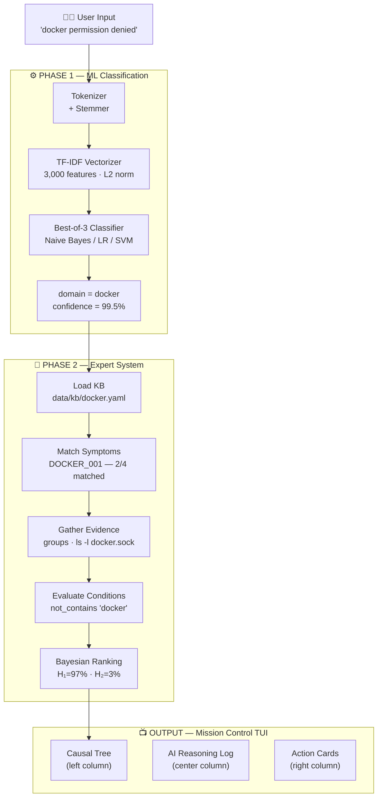
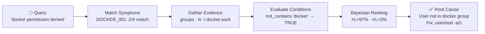
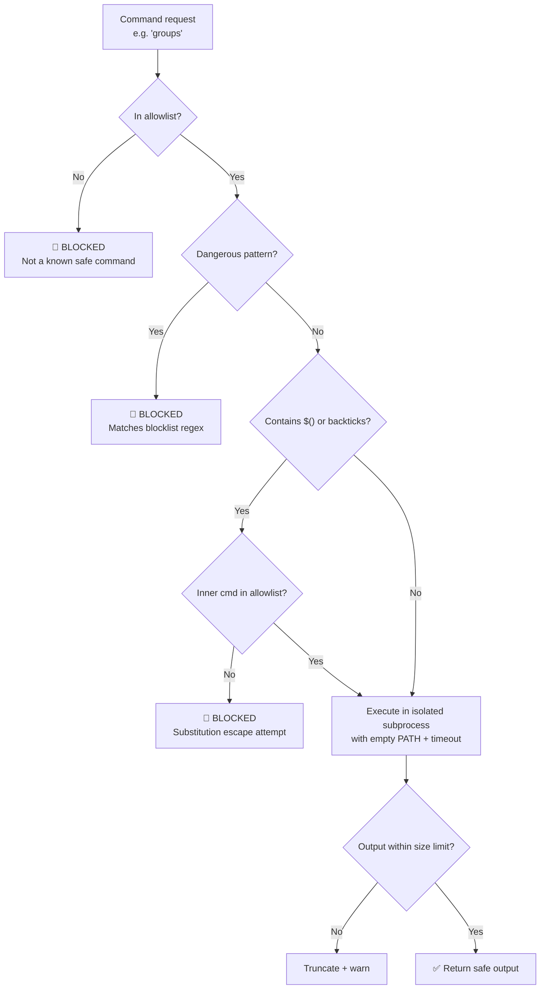

# 🐧 Linux Doctor — Presentation Deck (Enhanced)

> **Hybrid AI System for Automated Linux Troubleshooting**  
> ML Classification · Expert System · Safe Shell Execution

---

# SLIDE 1 — Title

# 🐧 LINUX DOCTOR

## *Hybrid AI for Automated Linux Troubleshooting*

---

| Component | What it does |
|:---:|:---:|
| 🤖 **ML Classifier** | Detects failure domain (99.49% F1) |
| 🧠 **Expert System** | Forward-chains rules → root cause |
| 🛡️ **Safe Shell** | 7-layer sandbox, read-only execution |

---

**End-to-end example:**

```
"docker permission denied"
     │
     ├─ [ML] domain = docker @ 99.5%
     ├─ [Expert] rule DOCKER_001 → user not in docker group
     └─ [Fix]  sudo usermod -aG docker $USER
```

> **99.49% F1 · 12 domains · 101,758 training samples · 4,500 LOC · 6 dependencies**

---

# SLIDE 2 — The Problem

## Why Linux Troubleshooting Is Broken

```
🧑‍💻 SRE gets alert at 3 AM
         │
         ├── 🔍 SSH into server
         ├── 📋 Check logs manually
         ├── 🤔 Recall tribal knowledge
         ├── 🧪 Run commands, grep, guess
         └── ⏱️  30–60 mins later... maybe fixed
```

---

## Three Core Pain Points

| # | Pain Point | Root Cause | Impact |
|---|---|---|---|
| 1 | **Fragmented knowledge** | Docker ≠ Nginx ≠ SSH ≠ DNS — each domain is a specialty | SREs must be generalists across 12+ problem spaces |
| 2 | **Manual diagnosis loop** | SSH → run commands → grep logs → reason step by step — **every single time** | Slow, error-prone, non-reproducible |
| 3 | **No institutional memory** | Fixes live in Slack threads, personal notes, people's heads | Same incident recurs — reinventing the wheel |

---

## The Opportunity

```
SREs spend 30–40% of their time on diagnostics

→ Linux Doctor automates the diagnosis loop
→ Covers 12 highest-frequency Linux failure domains
→ Deterministic, explainable, auditable — not a black box
```

---

# SLIDE 3 — Architecture Overview

## Two-Phase Hybrid Pipeline



> **Key design principle:** ML handles the *"what domain?"* question. The Expert System handles the *"what exactly is wrong?"* question.

---

# SLIDE 4 — ML Pipeline (Phase 1)

## From Raw Text to Domain Label

```
Input:  "docker permission denied"
           │
           ▼
   ┌─ Tokenizer (regex word split) ─────────────────────┐
   │  + Porter-lite Stemmer                              │
   │  ["docker", "permiss", "deni", "socket"]            │
   └─────────────────────────────────────────────────────┘
           │
           ▼
   ┌─ TF-IDF Vectorizer (pure NumPy) ───────────────────┐
   │  Vocabulary: 3,000 top features · L2 normalized     │
   │  [0.0, 0.45, 0.32, 0.0, ..., 0.78]  (sparse vector)│
   └─────────────────────────────────────────────────────┘
           │
           ▼
   ┌─ Ensemble: Best-of-3 Classifiers ──────────────────┐
   │  → domain = docker                                  │
   │  → confidence = 99.5%                               │
   └─────────────────────────────────────────────────────┘
```

---

## Classifier Comparison

| Classifier | Algorithm | Key Technique | F1 Score |
|---|---|---|:---:|
| 🥇 **Naive Bayes** | Multinomial | Log-space + Laplace smoothing | **99.49%** |
| 🥈 Linear SVM | One-vs-Rest | Hinge Loss + SGD | 99.40% |
| 🥉 Logistic Regression | Softmax | SGD + L2 regularization | 99.20% |

---

## Dataset Profile

| Property | Value |
|---|---|
| Total samples | 101,758 |
| Domains | 12 |
| Split strategy | 80/20 stratified |
| Feature extraction | TF-IDF (no sklearn) |
| Implementation | Pure NumPy — zero sklearn/PyTorch |

> ⚡ **Zero external ML libraries.** All three classifiers implemented from scratch using NumPy only.

---

# SLIDE 5 — ML Math (From Scratch)

## The Three Algorithms Side by Side

---

### 🔵 Naive Bayes

$$\log P(H | \mathbf{x}) = \log P(H) + \sum_{i} x_i \cdot \log P(w_i | H)$$

```python
# Smoothed log-probability (avoids underflow)
log_prob[c] = log(count(w, c) + α)
            - log(count(c) + α × V)
```

**Why it wins:** Sparse TF-IDF vectors + log-space computation = numerically stable, fast, hard to beat on short text.

---

### 🟠 Logistic Regression (Softmax)

```
scores  = X @ W + b
probs   = softmax(scores)          # e^s / Σ e^s
loss    = CrossEntropy(probs, y) + λ||W||²
W      -= lr × ∇W                  # SGD update
```

---

### 🔴 Linear SVM (One-vs-Rest)

```
For each class c, and each wrong class j:
  margin = score(c) - score(j) + 1

  if margin > 0:          # hinge loss fires
    W[c] -= lr × x_i     # gradient step
    W[j] += lr × x_i
```

---

# SLIDE 6 — Expert System (Phase 2)

## Knowledge Base Structure (YAML)

```yaml
# data/kb/docker.yaml
rules:
  - id: DOCKER_001
    name: "Permission Denied on Docker Socket"
    
    symptoms:           # trigger if ANY match
      - "permission denied"
      - "docker.sock"
    
    evidence:           # commands to run for facts
      - command: "groups"
        store_as: "user_groups"
      - command: "ls -l /var/run/docker.sock"
        store_as: "socket_info"
    
    conditions:         # logic evaluated on facts
      - fact: user_groups
        operator: not_contains
        value: "docker"
    
    hypotheses:         # ranked conclusions
      - text: "User is not in the 'docker' group"
        confidence: 0.95
        fix: "sudo usermod -aG docker $USER"
        risk: moderate   # LOW / MODERATE / HIGH
```

---

## Forward-Chaining Flow



---

## Evidence-Condition-Hypothesis Chain

| Step | What Happens | Example |
|---|---|---|
| **Symptom match** | Rule IDs shortlisted | `permission denied` → DOCKER_001, PERM_003 |
| **Evidence gather** | Safe shell runs read-only cmds | `groups` → `"ntbankey sudo"` |
| **Condition eval** | Boolean logic on gathered facts | `not_contains("docker")` → `True` |
| **Hypothesis rank** | Bayesian posterior computed | H₁ 97% wins over H₂ 3% |
| **Output** | Root cause + confidence + fix | DOCKER_001 @ 95% |

---

# SLIDE 7 — Bayesian Hypothesis Ranking

## Why Bayes? Because Real Systems Have Competing Explanations

The same symptom (`"docker permission denied"`) can have **multiple root causes**.  
We need a principled way to pick the most likely one.

---

## The Formula

$$P(H | E) = \frac{P(H) \times P(E | H)}{P(E)}$$

| Term | Meaning | Source |
|---|---|---|
| `P(H)` | Prior probability of this hypothesis | Set in YAML (`confidence: 0.95`) |
| `P(E \| H)` | How likely is this evidence given H is true | Computed per evidence result |
| `P(H \| E)` | Posterior — updated belief after seeing evidence | **Output** |

---

## Full Worked Example

```
Scenario: "docker permission denied"

─── Competing Hypotheses ──────────────────────────────────
  H₁: User NOT in docker group      Prior = 0.95
  H₂: Docker daemon NOT running     Prior = 0.80

─── Evidence Collected ────────────────────────────────────
  E₁: groups → "ntbankey sudo"      → strongly supports H₁
  E₂: /var/run/docker.sock EXISTS   → strongly supports H₁
  E₃: `docker info` returns error   → mildly supports H₂

─── Bayesian Update ───────────────────────────────────────
  P(H₁ | E₁, E₂) = 0.95 × 0.90 × 0.85 / Z  →  97% ✅ WINNER
  P(H₂ | E₁, E₂) = 0.80 × 0.15 × 0.30 / Z  →   3%

─── Decision ──────────────────────────────────────────────
  Margin = 94%  →  H₁ confirmed as root cause
  Fix: sudo usermod -aG docker $USER
```

---

## Why Not Just Take the Highest Prior?

| Approach | Problem |
|---|---|
| Take highest prior always | Ignores evidence — wrong when facts contradict prior |
| Pure rule matching | Brittle — can't handle partial evidence |
| **Bayesian update** ✅ | Updates belief as evidence arrives — handles uncertainty |

---

# SLIDE 8 — Safety Architecture (7 Layers)

## Threat Model

```
🎯 Attack vectors we defend against:
   ├── 1. Command injection via user input
   ├── 2. Path traversal attacks
   ├── 3. Subprocess escape via $() or backticks
   ├── 4. Resource exhaustion (output floods, infinite loops)
   ├── 5. Environment variable / PATH manipulation
   └── 6. Runaway child processes after timeout
```

---

## The 7-Layer Defense Stack

```
┌────────────────────────────────────────────────────────────────┐
│ Layer 1 ── ALLOWLIST                                           │
│   80+ read-only commands only                                  │
│   systemctl · journalctl · ss · ip · ping · df · free · ls    │
│   cat · grep · awk · sed · ps · top · netstat · dig ...       │
├────────────────────────────────────────────────────────────────┤
│ Layer 2 ── DANGEROUS PATTERN BLOCKLIST                        │
│   rm -rf /        →  "wipe filesystem"                        │
│   dd if= of=      →  "overwrite block device"                 │
│   mkfs            →  "format disk"                            │
│   > /dev/sda      →  "raw device write"                       │
├────────────────────────────────────────────────────────────────┤
│ Layer 3 ── COMMAND SUBSTITUTION GUARD                         │
│   $(inner_cmd)    →  inner_cmd must be in allowlist too       │
├────────────────────────────────────────────────────────────────┤
│ Layer 4 ── BACKTICK BLOCKING                                  │
│   `rm -rf /`      →  blocked at parse time                    │
├────────────────────────────────────────────────────────────────┤
│ Layer 5 ── PROCESS GROUP ISOLATION                            │
│   os.setpgrp()    →  entire process group killed on timeout   │
├────────────────────────────────────────────────────────────────┤
│ Layer 6 ── OUTPUT SIZE LIMIT                                  │
│   Truncates output → prevents memory exhaustion               │
├────────────────────────────────────────────────────────────────┤
│ Layer 7 ── MINIMAL ENVIRONMENT                                │
│   Empty PATH      →  prevents PATH injection attacks          │
└────────────────────────────────────────────────────────────────┘
```

---

## Decision Flow for Any Command



---

# SLIDE 9 — Mission Control TUI

## Interface Design Philosophy

The TUI gives operators a **single-pane view** of the entire diagnosis — no need to switch contexts.

```
╔══════════════════════════════════════════════════════════════════════╗
║  🐧 LINUX DOCTOR  ·  Mission Control  ·  Domain: DOCKER (99.5%)     ║
╠═════════════════════╦══════════════════════╦════════════════════════╣
║   📊 CAUSAL TREE    ║   🤖 AI REASONING    ║   ⚡ ACTION CARDS      ║
║                     ║                      ║                        ║
║  🔴 DOCKER          ║  14:30:45            ║  ┌──────────────────┐  ║
║   └─ Symptom        ║  🔍 Matched          ║  │ ✅ RISK: LOW     │  ║
║       "docker        ║     symptoms         ║  │                  │  ║
║        perm..."      ║     DOCKER_001       ║  │ groups           │  ║
║   └─ Evidence       ║                      ║  │ Check user       │  ║
║       groups        ║  14:30:46            ║  │ groups first     │  ║
║       socket_info   ║  ⚡ Rule fired       ║  └──────────────────┘  ║
║   └─ Root Cause     ║                      ║                        ║
║       Not in group  ║  14:30:47            ║  ┌──────────────────┐  ║
║                     ║  📡 Evidence         ║  │ ⚠️ RISK: MOD.   │  ║
║  Confidence:        ║     gathered         ║  │                  │  ║
║  ████████░░ 95%     ║                      ║  │ usermod -aG      │  ║
║                     ║  14:30:48            ║  │ docker $USER     │  ║
║                     ║  ✅ H₁ confirmed     ║  └──────────────────┘  ║
║                     ║     margin: 94%      ║                        ║
╚═════════════════════╩══════════════════════╩════════════════════════╝
```

---

## Column Roles

| Column | Purpose | Key Info |
|---|---|---|
| **Causal Tree** (left) | Visual DAG of symptoms → evidence → root cause | Confidence bar, node colours by severity |
| **AI Reasoning** (center) | Timestamped trace of every decision step | Fully auditable — no black box |
| **Action Cards** (right) | Ordered fix list, colour-coded by risk level | LOW 🟢 · MODERATE 🟡 · HIGH 🔴 |

---

## REPL Commands

| Command | Description |
|---|---|
| `/explain` | Print full reasoning chain in natural language |
| `/fix` | Execute the top-ranked fix |
| `/fix <n>` | Execute fix number n |
| `/history` | Show past incidents from SQLite |
| `/safe` | Preview what a command does before running |
| `/exit` | Quit |

---

# SLIDE 10 — 12 Supported Domains

## Coverage Map

| # | Domain | KB File | Rules | Common Triggers | Example Fix |
|---|---|---|---|---|---|
| 1 | 🐳 **Docker** | `docker.yaml` | 8 | permission denied, container OOM exit | `usermod -aG docker` |
| 2 | 🌐 **Nginx** | `nginx.yaml` | 10+ | failed to start, 502 bad gateway | check config syntax |
| 3 | 🔑 **SSH** | `ssh.yaml` | 8 | connection refused, key rejected | `systemctl start sshd` |
| 4 | 🖥️ **CPU** | `cpu.yaml` | 6 | high load average, process stuck | `kill -9 <pid>` |
| 5 | 💾 **Memory** | `memory.yaml` | 6 | OOM killer fired, swap full | identify top consumers |
| 6 | 💽 **Disk** | `disk.yaml` | 8 | no space left, inode exhausted | `du -sh` + cleanup |
| 7 | 🌍 **Network** | `network.yaml` | 8 | no route to host, timeout | check routes + firewall |
| 8 | 📡 **DNS** | `dns.yaml` | 6 | resolution failed, NXDOMAIN | check `/etc/resolv.conf` |
| 9 | 🔄 **Git** | `git.yaml` | 8 | merge conflict, auth failed | rebase or reset |
| 10 | ⚙️ **Systemd** | `systemd.yaml` | 10+ | service failed, unit not found | `journalctl -xe` |
| 11 | 📦 **Package** | `package.yaml` | 8 | dependency broken, repo error | `apt --fix-broken install` |
| 12 | 🔒 **Permission** | `permissions.yaml` | 8 | access denied, EACCES | `chmod`/`chown` + ACL |

---

## Extensibility: Zero-Code Domain Addition

```
Want to add a new domain (e.g. PostgreSQL)?

Step 1:  Write  data/kb/postgres.yaml
         Define: symptoms, evidence commands, conditions, hypotheses

Step 2:  Drop it in data/kb/

Step 3:  Linux Doctor auto-discovers it on next run

→ Zero Python changes required
→ No retraining needed (ML model catches new keywords via TF-IDF)
→ New rules active immediately
```

---

# SLIDE 11 — Roadmap & Live Demo

## What's Shipped ✅

| Component | Status | Detail |
|---|---|---|
| ML Pipeline | ✅ Done | 99.49% F1 · 3 classifiers · pure NumPy |
| Expert System | ✅ Done | Forward-chaining + Bayesian ranker |
| Safety Shell | ✅ Done | 7-layer sandbox · 80+ allowlisted cmds |
| Mission Control TUI | ✅ Done | Rich 3-column layout |
| Interactive REPL | ✅ Done | /explain · /fix · /history |
| SQLite Persistence | ✅ Done | WAL mode · incident history |
| 12 KB Domains | ✅ Done | ~90 rules total |
| Full Test Suite | ✅ Done | Unit + integration coverage |

---

## Roadmap 2026 🚀

| Priority | Feature | Why | Target Metric |
|---|---|---|---|
| ⚡ P1 | **Parallel evidence collection** | Evidence gather runs sequentially now — biggest latency bottleneck | < 2s per diagnosis (from ~15s) |
| 🗄️ P2 | **Full incident history** | SQLite good for single-node; multi-user needs shared DB | SQLite → PostgreSQL |
| 🧠 P3 | **Backward chaining** | Currently forward only — backward chaining enables goal-directed queries | Bidirectional reasoning |
| 🌐 P4 | **HTTP API** | Enable integration with monitoring tools (PagerDuty, Grafana) | RESTful endpoint |
| 📊 P5 | **Prometheus metrics** | Observe diagnosis latency, accuracy, fix success rates | Grafana dashboard |

---

## Live Demo Script 🎯

```bash
# ── Demo 1: Docker ─────────────────────────────────────────────
$ linux-doctor "docker permission denied"

  [ML]     domain = docker @ 99.5%
  [Expert] rule DOCKER_001 matched (2/4 symptoms)
  [Shell]  groups → "ntbankey sudo"     (no docker group)
  [Bayes]  H₁=97%  >  H₂=3%
  [Output] Root cause: user not in docker group
           Fix: sudo usermod -aG docker $USER


# ── Demo 2: SSH ─────────────────────────────────────────────────
$ linux-doctor "ssh connection refused port 22"

  [ML]     domain = ssh @ 98.2%
  [Expert] rule SSH_001 matched
  [Shell]  systemctl status sshd → inactive (dead)
  [Output] Root cause: sshd not running
           Fix: sudo systemctl start sshd


# ── Demo 3: Interactive REPL ────────────────────────────────────
$ linux-doctor

> disk full
  [ML] domain = disk @ 97.8%  →  gathering evidence...
  [TUI] Mission Control opens

> /explain
  Reasoning: inode count exhausted, not block size.
  Top consumer: /var/log (14GB in 3 days)

> /fix 1
  Running: sudo journalctl --vacuum-time=7d
  ✅ 11GB freed. Disk usage: 94% → 61%
```

---

# BONUS — Q&A Reference Sheet

## Key Metrics at a Glance

| Metric | Value |
|---|---|
| Best model | Naive Bayes (99.49% F1) |
| Training samples | 101,758 |
| ML features | 3,000 TF-IDF |
| KB domains | 12 |
| KB rules total | ~90 |
| Allowlisted commands | 80+ |
| Safety layers | 7 |
| Source code | ~4,500 lines Python |
| Dependencies | 6 core packages |
| Database | SQLite (WAL mode) |
| TUI library | Rich |

---

## Anticipated Questions

---

**Q1: "Why not just use an LLM (GPT-4, Gemini) instead?"**

| Dimension | LLM | Linux Doctor |
|---|---|---|
| Cost | $$ per query | Free, runs locally |
| Speed | 3–10s per response | < 2s (target) |
| Hallucination | Yes — can suggest wrong/dangerous fixes | No — rule-based, deterministic |
| Auditability | Black box | Full trace via /explain |
| Runs offline | No | Yes — Raspberry Pi capable |
| Extensible | Needs prompt engineering | Add one YAML file |

> **Verdict:** LLMs are powerful but expensive, slow, and non-deterministic for ops tooling. A lightweight ML + rule engine is more appropriate for safety-critical automation.

---

**Q2: "How do you prevent damage to production systems?"**

```
7-Layer Safety Stack prevents ALL of:
  ✅ Injection attacks        (allowlist + pattern block)
  ✅ Subprocess escape        ($() and backtick guard)
  ✅ Runaway processes        (process group isolation + timeout)
  ✅ Memory exhaustion        (output size cap)
  ✅ PATH injection           (empty environment)

Only 80+ read-only diagnostic commands are permitted.
No destructive command can pass all 7 layers.
```

---

**Q3: "How to add a new domain?"**

```
1. Write data/kb/<domain>.yaml
   Define: symptoms · evidence · conditions · hypotheses

2. Drop the file in data/kb/

3. Done. Zero code changes. Auto-discovered at runtime.
```

---

**Q4: "How accurate is the ML in real production traffic (not synthetic data)?"**

Honest answer: the 99.49% F1 is on a **synthetic** dataset.  
Real production accuracy will be lower due to:
- Novel phrasings not in training data
- Mixed-domain errors (e.g. SSH issue described using network vocabulary)

Mitigations in roadmap:
- Real incident corpus collection
- Active learning from /history corrections
- Confidence threshold → fallback to manual if below 80%
